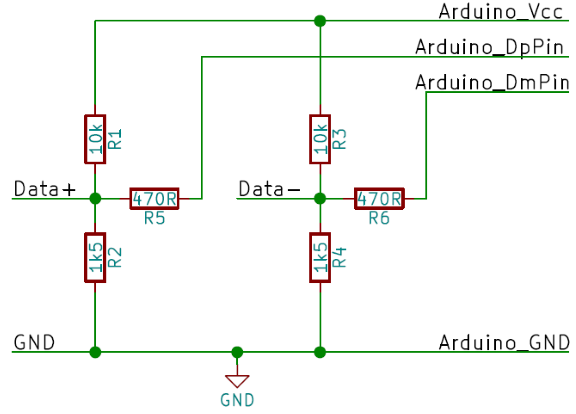
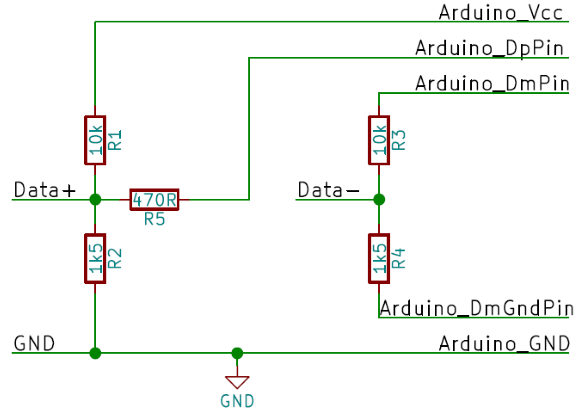

# QC3Control
Set the voltage of a Quick Charge 3.0 (class A) source via Arduino.  

By Vincent Deconinck

All credits go to :
- [Hugatry's HackVlog](https://www.youtube.com/channel/UCHgeChD442K0ah-KxEg0PHw) because he came up with the idea and first code to control QC2. 
- Timo Engelgeer (Septillion) who made a nice wrapper for Quick Charge 2.0: [QC2Control](https://github.com/septillion-git/QC2Control). The QC3Control project is just a fork of QC2Control adapted for Quick Charge3 while retaining maximum compatibility so it can be used as a drop-in replacement.

## What does it do?
QC3Control makes it possible to set the voltage (even on the fly) of a Quick Charge 3.0 source like a mains charger or power bank by simulating the behaviour of a QC3 portable device. 

Currently, only QC3.0 class A (up to 12V) is supported. QC3.0 class B (up to 20V) should be a minor change, but due to the lack of hardware to test, the libary only targets class A for now. Consequently, possible voltages are 5V (USB default), 9V or 12V, plus any value between 3.6V and 12V obtained by 200mV steps from one of the 3 previous voltages. 

Of course, to take advantage of this library, the source needs to support the [Quick Charge 3.0](https://www.qualcomm.com/products/features/quick-charge) technology form [Qualcomm](https://www.qualcomm.com/). 
However, the library can also be used with a QC2.0 compatible charger if using only set5V(), set9V() and set12V().

## Differences between QC2Control and QC3Control
QC3 chargers and battery packs should be backwards compatible with QC2, but I first had to adjust the resistor values compared to the ones in QC2Control. More information on [my blog](http://blog.deconinck.info/post/2017/08/09/Turning-a-Quick-Charge-3.0-charger-into-a-variable-voltage-power-supply).

Apart from that, the main protocol difference between QC2.0 and QC3.0 (class A) is the introduction of continuous voltages, plus the possibility to lower the voltage to 3.6V.

To reach QC3.0 continuous mode, D- must be set high, which can be achieved two ways:
- either by slightly modifying the QC2Control circuit and "disconnecting" the bottom resistor of the D- divider when needed. In that case, the divider acts as a pull up for USB D-. I call this circuit "legacy".
- or by using a new circuit which basically duplicates the D+ configuration to the D- side: a divider between VCC and GND plus a third resistor to the Arduino "DM" pin. In that case, outputting a HIGH level to the third resistor, a voltage of 3.3V or more can be set on USB D-. This is the recommended circuit as it does not require an additional Arduino pin.

Both circuits are supported by the library, but basically, I suggest you first try the recommended circuit, and if your QC3 charger refuses to generate anything else than 5V, then try with the legacy circuit, changing the constructor in the code accordingly.

### How to connect?
As indicated above, the library supports the 2 following configurations. In all cases, all you need is a few resistors and (optionally) two diodes (see next section).

a) Recommended "2-wire" circuit.



b) Legacy "3-wire" circuit: Apart from the values, it is similar to the QC2Control circuit but requires a third Arduino pin instead of GND on the D- divider. Not recommended unless you have issues with the "2-wire" version 



The wire color for a normal USB-cable is:  
- V<sub>BUS</sub>: Red  
- Data+: Green  
- Data-: White  
- GND: Black

You're free to pick any pin on the Arduino, just be sure to point to the right pins in QC3Control().

#### Diodes
Although the regulator on a Arduino Pro Mini should be able to handle 12V (with a light load) some clones don't like 12V and release the [magic smoke](https://en.wikipedia.org/wiki/Magic_smoke). Adding two diodes will drop the voltage slightly (about 1.5V) so the Arduino can handle the voltage, even if it's set to 12V.

Because the Arduino can only provide a small current the small and cheap 1N4148 will do. But any other (non-Schottky) should work like a 1N4007 etc.

Warning though: Please note that if you add the diodes, you may not be able to reach lower voltages allowed by the QC3 specification (down to 3.6V) as the Arduino may not receive enough voltage.
 
If you have a multi-port QC3 charger, a good alternative to those diodes is to power the Arduino from one (possibily non-QC) port with 5V and use it to control the voltage of the another (QC3) port. In that case, don't forget to connect the GND of both ports together (but **NOT** their VCCs of cource).

## Download and install
### Library manager
QC3Control is available via Arduino IDE Library Manager.

1.  Open the Arduino IDE (1.5 or above).
2.  In the tool-bar click Sketch -> Include Library -> Manage Libraries...
3.  Type in the search bar "QC3Control".
4.  The latest version of QC3Control should show.
5.  Click on it and click Install.
6.  Done!

### GitHub
Latest release: **[v1.2.0](https://github.com/vdeconinck/QC3Control/archive/v1.2.0.zip)**

1. Download the latest release.
2. Extract it to the `libraries` folder **inside** your Sketchbook. Default is `[user]\Arduino\libraries`. 
3. Rename the folder to `QC3Control` (remove version number).
4. Restart the Arduino IDE if you had it open.
5. Done!

### Update
You can update to the latest version of the library in the Library Manager as well. 

1.  Open the Arduino IDE (1.5 or above).
2.  In the tool-bar click Sketch -> Include Library -> Manage Libraries...
3.  Type in the search bar "QC3Control".
4.  The QC3Control library should show.
5.  **Click on it** and click Update.
6.  Done!

Alternatively you can download it from GitHub and simply unpack it over the current version (or remove the old version first).

## Usage
Just see this simple sketch (assuming the recommended circuit is used)
```C++
#include <QC3Control.h>

//Pin 4 for Data+
//Pin 5 for Data-
//See How to connect in the documentation for more details.
QC3Control quickCharge(4, 5);

void setup() {
  //Optional
  //quickCharge.begin();
                                              
  //set voltage to 12V
  quickCharge.set12V();

  delay(1000);
}

void loop() {
  //And you can change it on the fly
  delay(1000);
  quickCharge.set9V();
  delay(1000);
  quickCharge.set5V();
  delay(1000);
  quickCharge.setVoltage(6);
  delay(1000);
  for (int i = 0; i < 10; i++) quickCharge.decrementVoltage();
  delay(1000);
  quickCharge.set12V();
}
```
**Please note**, delay() here is just used to demonstrate. Better not to stop the complete program with delay()'s.

If you can, place the call to begin() (or setVoltage()) at the end of the setup(). The handshake needs a fixed time but that already starts when the QC 3.0 source (and thus the Arduino) is turned on. So by doing begin() last you can do stuff while waiting.

### Constructors
#### QC3Control(byte DpPin, byte DmPin)
[QC2 or QC3 power source] This will create a QC3Control object to control the voltage of the Quick Charge source when using the recommended "2-wire" circuit. DpPin is the pin number for the Data+ side, DmPin is the pin number for the Data- side. See [**How to connect?**](#how-to-connect).

#### QC3Control(byte DpPin, byte DmPin, byte DmGndPin)
[QC2 or QC3 power source] This will create a QC3Control object to control the voltage of the Quick Charge 3.0 source when using the legacy "3-wire" circuit. DpPin is the pin number for the Data+ side, DmPin is the pin number for the upper resistor of the Data- side and DmGndPin is the pin number for the lower resistor of the Data- side. See [**How to connect?**](#how-to-connect).

### Methods
#### void .begin()
[QC2 or QC3 power source] Just does the handshake with the Quick Charge 3.0 source so it will accept commands for different voltage. It's not mandatory to call begin(), if it's not called before setting a voltage the library will call begin() at that moment.

#### void .set5V(), .set9V() and .set12V()
[QC2 or QC3 power source] Sets the desired voltage of the QC source using discrete (QC2) mode. 

#### void .setVoltage(double volt), setMilliVoltage(unsigned int milliVolt)
[QC3 power source only] Sets the desired voltage of the QC3.0 source using continuous (QC3) mode. Setting an unreachable voltage will result in the closest supported voltage.

#### double getVoltage(), unsigned int getMilliVoltage()
[QC2 or QC3 power source] Return the last voltage that was requested, or the closest one in the range 3.6 - 12V. 

Note that these methods return the value the library requested, not the actual voltage which may be different if the power source did not behave as exepected.

#### void incrementVoltage(), decrementVoltage()
[QC3 power source only] Requests an increment or decrement of the voltage by 0.2V

## Full documentation
Full documentation of all the methods of this library can be found inside the library located in `QC3Control\doc`. Just open `QC3Control\doc\index.html` to see all methods of QC3Control. 

You can also view the documentation via [GitHub HTML Preview](https://htmlpreview.github.io/?https://github.com/vdeconinck/QC3Control/master/doc/index.html).

This documentation is powered by [Doxygen](http://www.doxygen.org/) and thus fully extracted from the source files. This README.md is also used as Main Page.

## FAQ

### Can I control more the one Quick Charge source with a single Arduino?
Yes you can! Just make multiple QC3Control objects connected to different pins. But be sure to connect GND of all power supplies (including QC3.0 sources) together but **not** the voltage rails.